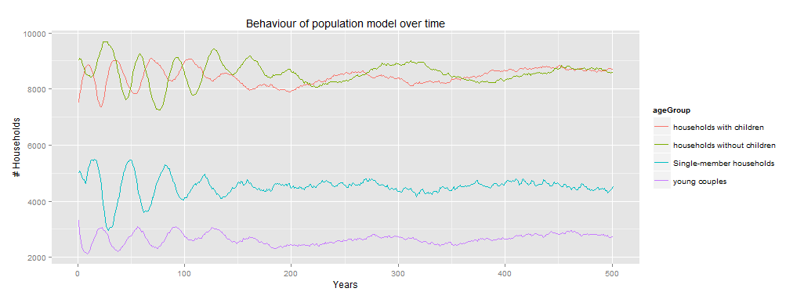
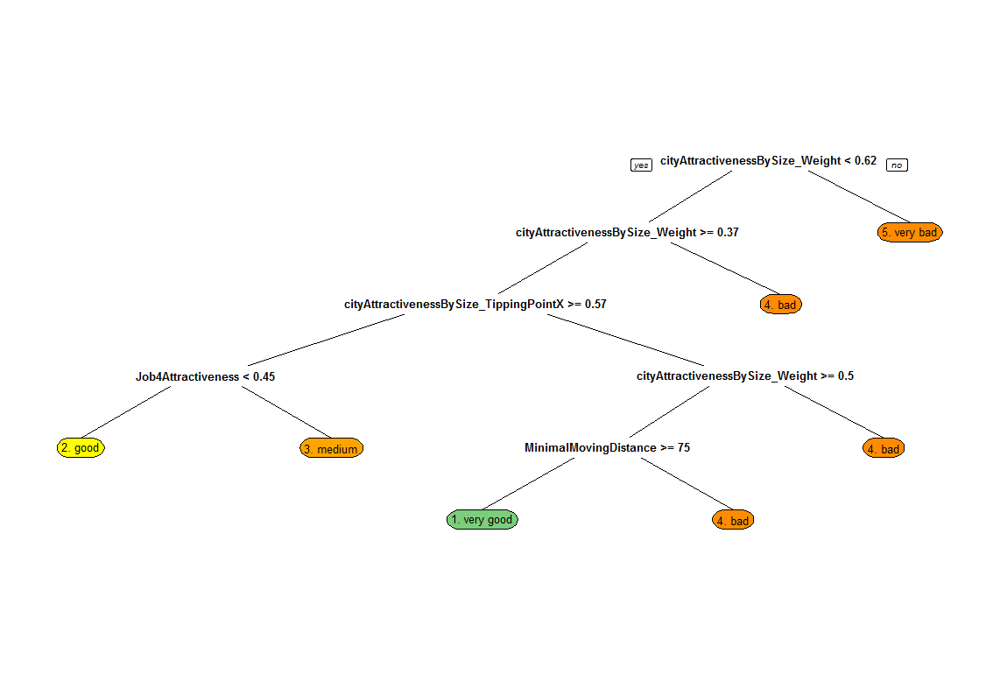

# Model experimentation
So far this document has focussed on the conceptualising, building and testing of a model for determining the effect of household-level decision making on the emergence of a Zipf's Law in city size distribution. The following section will go in depth on the experimental design used to analyze the model's behaviour and the results which came from it.

The model should be considered to be an infinite system. Such a system will not return to its initial state after a predertermined amount of time. Since the model is an infinite system a warm-up time will be required before data can be gathered from the model. The system is expected to reach steady-state after a full life-cycle of the initial households. Since the life-expectency of a household (not a person) is about 40-60 year, the model warm-up time should be higher than 60 years. Apart from reaching steady state in migrational behaviour, the model also exhibits some transitory behaviour in the initial period with regards to the total population (see figure x). This population system reaches steady state at around 250 years. However, in experimentation it was found that this transitory behaviour does not effect the outcomes heavily and therefore this factor was omitted in determining the warm-up period as to reduce total model run time. Therefore, For this experimentation a warm-up period of 80 years is chosen.

As became clear in section x, there are large uncertainty bands around many of the model parameters. For this study, a multi-variate analysis was set up in order to determine which factor or combination of factors has the largest effect on an emergence of a Zipf's Law. 

Due to the large input space a full-factorial experimental design in unfeasible within the set time-constraints. Within these time-constraints it was possible to perform about 300 model runs. In order to still get decent results, latin hypercube sampling was used as a sampling method to ensure a uniform distribution over the input space.

After running the model the individual runs were evaluated on how well they approach a Zipf's Law. This was done by calculating the root-mean-square error of a run compared to a true zipfian distribution with 1 as a Zipf's coefficient. 

Analyzing the effects of the change in input parameters on the model behaviour was done by using a decision tree. This decision tree was inferred using an C4.5 Decision Tree inference algorithm supplied by the RPart R Package. In order to avoid overfitting on the data, the tree was pruned optimizing on a lowest cross-validation error. The results of this decision tree are shown in figure x.

This decision tree shows that a zipf's law is most likely to emerge when the weight of the city attractiveness by size modifier is between 0.5 and 0.63, and when the people are less inclined to move to cities within 75 patches from them. 
This result has been verified by running 20 new independent replications with these settings. From these runs around x% is once again very close to a zipfian distribution and therefore we consider this to be correct.

