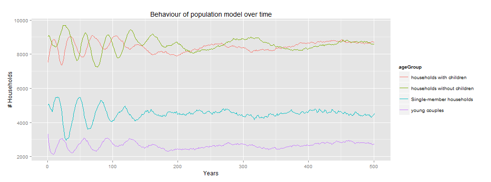

# Model verification
Before employing the model to examine the effect of household decision making on the emergence of a Zipf's law, it is necessary to ensure the model is verified and valid. Model verification is used to determine whether the built model performs in a manner in which it was intended to perform. The model was verified on three distinct levels: Single-agent level, in which the behaviour of a single household is analysed; minimal interaction level, in which the interaction between a small set of agents is observerd; and multi-agent verification which analyses the emergent behaviour of multiple agents.

## Single-agent verification
There is only a single type of agent in this urban migration model, namely households. Households live in a certain location and consist of household members. 

As described in section x, households follow a certain lifestage progression chain. This lifestage progression has been verified by attempting to falsify the outcomes. To do this, we have first determined the possible composition s of households. Then, a large number (100,000) of households were generated and the model was run for 100 years. In addition, a test was written in NetLogo to verify whether any of the households were in a state which should not be possible. 

The possible household compositions are:

- Single member household with 16 < age < 30 OR age > 53
- Two member household with age > 23
- Households with children with two ages > 23 and children with 0 < age < 23

No households were found outside of the expected composition ranges and therefore it is assumed the household progression is implemented correctly. 

The second main behaviour of the households is determining the attractiveness of cities and migrating. Since determining the attractiveness of cities largely depends on the households living in them, this aspect cannot be tested at the single-agent level, but will be tested on the minimal interaction level. 

Aspects which can be verified on a single-agent level are the calculation of the resistance to move, of which a plot is shown in figure x and the actual choice of moving to a different city with preset city attractiveness. Both were found to show no errors. 

### Agent robustness
The implementation of agents in this model can be considered to be quite robust as no normal model runs can cause the agent to break. However, some notions need to be considered when generating custom household agents or when expanding on the model. First, the model assumes that the list of household members is always sorted descending by age. This assumption is made since it drastically improves the performance of several checks in the model. Furthermore, households with children that have fewer than two parents can cause the model to behave unexpected in several fields such as the calculation of city attractiveness and the overall lifestage progression.

## Minimal interaction level
The main behaviour on a minimal interaction level is determining the attractiveness of cities based on the people living in them. 

Several scenario's were set up and in each of these scenario's the attractiveness for a representative set of households was determined. 

In the first scenario the attractiveness of cities for manufacturing and agriculture jobs was tested. Three cities were set up containing respectively 5% of total inhabitants, 20% of total inhabitants and 50% of total inhabitants. The attractiveness of two households consisting of solely agricultural members and solely manufacturing members were then checked against the assumptions and found to be correct. The results are shown in table x.

| Inhabitants   |      Job      |  Attractiveness |
|:--------------|:--------------|------:|
| 5% 			| Agriculture 	| 0.68 |
| 5% 			| Manufacturing | 0.68 |
| 20% 			| Agriculture 	| 0.4 |
| 20% 			| Manufacturing | 0.4 |
| 50% 			| Agriculture   | 0.25 |
| 50% 			| Manufacturing | 0.25 |   

The second and third scenarios was set up to verify the attractiveness calculation for service and non-profit jobs. Three cities for each job were set up containing respectively a low number of people in that job (1%), a medium number of people (30%), and a high number of people (80%). The results are shown in table x.

| People in Job   |      Job      |  Attractiveness |
|:--------------|:--------------	|------:|
| 1% 			| Service 			| 0.84 |
| 1% 			| Non-Profit 		| 0.85 |
| 30% 			| Service 			| 0.53 |
| 30% 			| Non-Profit 		| 0.56 |
| 80% 			| Service   		| 0.14 |
| 80% 			| Non-Profit 		| 0.15 |   

The final two scenarios were set up to test the attractiveness for IT and Finance jobs. Four cities for each job were set up containing respectively a low number of people in that job (1%), an average number of people (4%), a moderately high number of people (6%), and a high number of people (8%). The results are shown in table x.

| People in Job   |      Job      |  Attractiveness |
|:--------------|:--------------|------:|
| 1% 			| IT 			| 0.87 |
| 1% 			| Finance 		| 0.87 |
| 4% 			| IT 			| 0.4 |
| 4% 			| Finance 		| 0.4 |
| 6% 			| IT   			| 0.6 |
| 6% 			| Finance 		| 0.6 |   
| 8% 			| IT   			| 0.6 |
| 8% 			| Finance 		| 0.6 |   

## Multi-agent level
On the multi-agent level the overall emergent behaviour of the model is tested under various circumstances. First, an extreme value analysis is performed on the two global model parameters which set the total number of households and the total number of cities in the model. 

Varying the the total cities in the model from 1 to 25 gives results as shown in figure x. As can be expected, the model does not behave with a very low number of cities. This is mostly because the option space of agents is then too small for interesting behaviour to emerge. From 10 cities and up the model shows expected behaviour. When further increasing the number of cities (>25) some care should be taken that the total number of households will also be increased. If this is not done, the average households per city will be too low which causes unexpected behaviour as described in the following section.

A similar test was performed by varying the the total number of households in the model from 1,000 to 100,000 (figure x). This analysis shows that the model is less suitable for use with a very low number of households (< 10,000). This has several causes: First of all, with such a low number of households it is more difficult for agents in the model to find partners, leading to a decline in total households over time. Furthermore, the city attractiveness effects are smaller which leads to a lower than intended rate of migration. When running the model with a very large number of agents, it can happen that there are large oscillations of city size in the start of the run. This behaviour is caused by two aspects. Firstly, there are several large oscillations in the population system underlying the model in the transitory state (see figure x). Another reason is that normally the city attractiveness only gets calculated on a yearly basis to improve performance. In order to increase the fidelity of large-scale models the "updateCityAttractivenessFreq" slider can be used to set the model to update this attractiveness on a more frequent basis. When this slider is set to a suitably small value, the model results will closer reflect the behaviour as it is with lower amounts of households.

Apart from extensively testing these two model input parameters a full parameter sweep with 300 model runs on all  other possible input parameters has been performed. In none of these model runs did the model give any errors and the results are all within the expected bounds (see figure x).

# Conclusion
This model has been verified by 6 tests on a single-agent, minimal interaction and multi-agent level. All of these tests show that the model is implemented in line with the intended implementation as described earlier. However, some care must be exercised in setting up the model for experimentation to make sure the input parameters are within certain bounds to ensure the model behaves as expected.